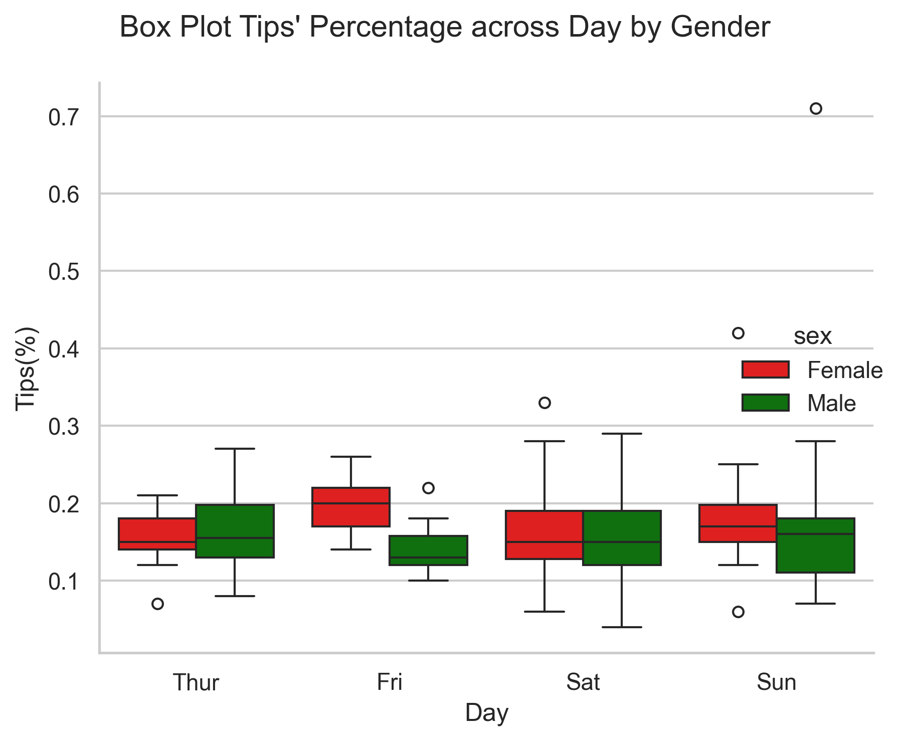
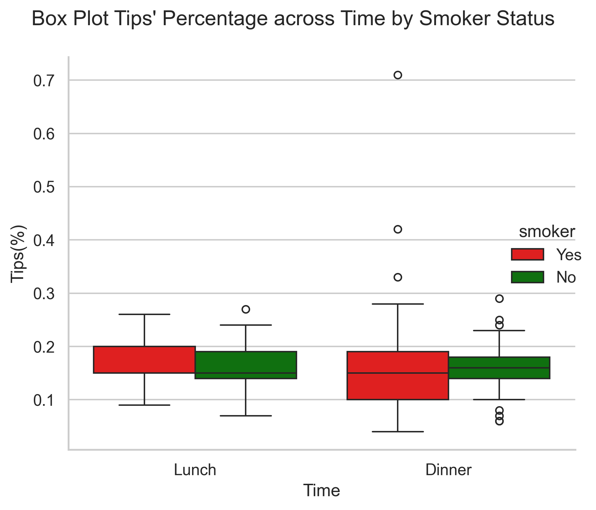
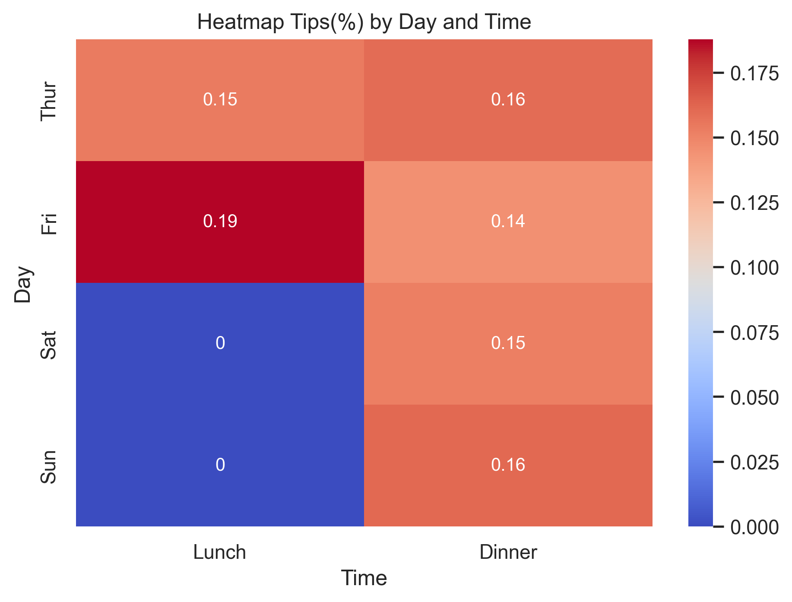

# 🧾 Tip Analysis Dashboard (Seaborn + Matplotlib)

This dashboard explores **tipping behavior** using Seaborn's `tips` dataset. It analyzes how tips vary by **total bill**, **day of the week**, **gender**, and **time of day** using clean and informative visualizations.

---

## 📊 Dataset

- **Source**: Seaborn built-in `tips` dataset
- **Key Columns**:
  - `total_bill`: Meal cost
  - `tip`: Tip amount
  - `sex`, `day`, `time`, `smoker` : Customer demographics and visit time
  - `size`: Party size

---

## 🔧 Requirements

Install the required packages:

```bash
pip install pandas seaborn matplotlib scipy

```
---
## 🧠 Questions & Visualizations

### 1. 💡 Q1: What's the relationship between Total Bill and Tip?
#### Chart: 
- Scatter Plot Based On Gender With Pearson Correlation
- Line Plot

#### Code:

``` python
#Data Preparation

sns.set_theme(style = 'whitegrid')
fig, ax = plt.subplots(1,2, figsize = (12,5))

hue_colors = {
    'Female':'Red',
    'Male':'Black'
}
total_bill = tips['total_bill']
tip = tips['tip']
male_total_bill = tips[tips['sex'] == 'Male']['total_bill']
male_tip = tips[tips['sex'] == 'Male']['tip']
female_total_bill = tips[tips['sex'] == 'Female']['total_bill']
female_tip = tips[tips['sex'] == 'Female']['tip']

#Person Correlation
overall_corr,_ = pearsonr(total_bill,tip)
male_corr,_ = pearsonr(male_total_bill,male_tip)
female_corr,_ = pearsonr(female_total_bill,female_tip)

#Scatter Plot
sns.scatterplot(
    data = tips, 
    x = 'total_bill',
    y = 'tip',
    hue = 'sex',
    hue_order=['Female','Male'],
    palette= hue_colors, 
    ax = ax[0]
)
ax[0].set_title('Total Bill vs Tip Amount by Gender', fontsize = 12)
ax[0].set_xlabel('Total_Bill', fontsize = 11)
ax[0].set_ylabel('Tip', fontsize = 11)
ax[0].tick_params(axis='x',labelsize = 11)
ax[0].tick_params(axis ='y', labelsize = 11)

correlations = [
    ('Overall',overall_corr),
    ('Male',male_corr),
    ('Female',female_corr)
]

start_y = 9.5
for i,(x,y) in enumerate(correlations):
    next_y = start_y - i*0.5
    start_x = ax[0].get_xlim()[1]*0.65 
    ax[0].text(
        start_x,
        next_y,
        f"{x} r = {y:.2f}",
        fontsize = 10,
        color = 'black',
        alpha = 0.6,
        bbox = dict(facecolor = 'white', alpha = 0.9)
    )

#LinePlot

sns.lineplot(
    data = tips,
    x = tips['total_bill'].round(0),
    y = 'tip',
    estimator='mean',
    markers='o',
    ax= ax[1]
)
ax[1].set_title('Average Tip over Total Bill', fontsize = 12)
ax[1].set_xlabel('Total_Bill', fontsize = 11)
ax[1].set_ylabel('Tip', fontsize = 11)
ax[1].tick_params(axis = 'x', labelsize = 11)
ax[1].tick_params(axis = 'y', labelsize = 11)

plt.tight_layout()
plt.show()
```


#### Insights: 
- **Line Plot:** Tips generally increase with bill size.
- **Scatter Plot**: 
  - Based on overall score **pearson correlation of 0.68**, there is **a moderate positive correlation** between **tips growth and total bill**. 
  - Breaking it down by **gender**, the results for both male and female show similarly **a moderate positive correlation.** 

### 2. 💡 How does tipping differ by day of the week?
#### Chart: Relplot (kind = Line)

#### Code: 

```python
a = sns.relplot(
    data = tips,
    kind = 'line',
    x = tips['total_bill'].round(0),
    y = 'tip',
    col = 'day',
    col_wrap= 2,
    col_order=['Thur','Fri','Sat','Sun'],
    markers = True
)

a.fig.suptitle('Average Tip over Total Bill across Days',
               y = 1.03)

a.set_axis_labels('Total_Bill','Tip')
plt.tight_layout()
plt.show()

```


#### Insights:
- While the positive correlation between total bill and tips holds for most days, **Sunday** deviates from this pattern, showing a **less predictable interaction** between spending and tipping.

### 3. 💡 Do customers tip differently at lunch vs dinner?
#### Chart: Relplot(kind = Scatter )

#### Code:
```python
a = sns.relplot(
    data = tips,
    kind = 'scatter',
    x = 'total_bill',
    y = 'tip',
    col = 'time',
    size= 'size',
    hue = 'size',
    markers = 'o'
)

a.fig.suptitle('Total Bill vs Tip across Time and Size',
               y = 1.03)

a.set_axis_labels('Total_Bill','Tip')
plt.tight_layout()
plt.show()
```


#### Insights:
- Both lunch and dinner show **the same trend:** as **total bills increase, so do the tips**.
- People tip more at **dinner**, and **larger groups (more than 2 people)** are more **frequent** in the **evening** than at lunchtime.

### 4.💡How many customers came in on each day of the week? Does gender play a role?

#### Chart: Count Plot

#### Code:
```python
hue_colors = {
    'Male':'Black',
    'Female':'Red'
}
hue_orders = ['Female','Male']
a = sns.countplot(
    data = tips,
    x = 'day',
    hue = 'sex',
    palette=hue_colors,
    hue_order=hue_orders
)
for i in a.patches:
    width = i.get_x() + i.get_width()/2
    height = i.get_height()
    a.text(
     width,
     height,
     f"{height:.0f}",
     fontsize = 10,
     ha = 'center',
     va = 'bottom'   
    )
a.set_title('Number of Customers Across Days by Gender')
a.set(xlabel = 'Day', ylabel='Count')
plt.tight_layout()
plt.show()
```


#### Insights: 
- On **weekdays (Thursday and Friday)**, male and female customer counts are **nearly equal**. But during the weekend, male attendance surges, being more than **twice as high** as female on **Saturday** and over **three times higher** on **Sunday.**

### 5. 💡 What’s the distribution of total bills and tip per day across gender?

#### Chart: Boxplot

Code:
```python
sns.set_theme(style='whitegrid')
fig,ax = plt.subplots(1,2, figsize=(12,5))

##Box Plot Total Bills Each Day across Gender
hue_colors = {
    'Male':'Green',
    'Female':'Red'
}
sns.boxplot(
    data = tips,
    x = 'day',
    y = 'total_bill',
    hue = 'sex',
    whis = [5,95],
    order=['Thur','Fri','Sat','Sun'],
    hue_order=['Female','Male'],
    palette=hue_colors,
    ax = ax[0]
)
ax[0].set_title('Box Plot Total Bill across Days by Gender')
ax[0].set_xlabel('Day')
ax[0].set_ylabel('Total Bill')

#Box Plot Tip Each Day across Gender

sns.boxplot(
    data=tips,
    x = 'day',
    y = 'tip',
    hue ='sex',
    whis = [5,95],
    order=['Thur','Fri','Sat','Sun'],
    hue_order=['Female','Male'],
    palette=hue_colors,
    ax = ax[1]
)
ax[1].set_title('Box Plot Tip across Day by Gender')
ax[1].set_xlabel('Day')
ax[1].set_ylabel('Tip')
plt.tight_layout()
plt.show()
```


#### Insights:
- **Female** tend to **spend lesser** than male throughtout days of the week. But **both of genders** spending **surge** on **weekend**.
- Although female spends lesser across the week, **female give more tips** than male on **Friday and Sunday**.

### 6. 💡 What is the average tip given by smokers vs. non-smokers across different meal times?

#### Chart: Catplot(kind = Point)

#### Code:
```python
a = sns.catplot(
    data=tips,
    kind='point',
    x = 'smoker',
    y = 'tip',
    col = 'time',
    estimator='mean',
    linestyle = 'none',
    errorbar= ('ci',95),
    capsize = 0.2
)

a.fig.suptitle('Point Plot Tip across Smoker by Day', y = 1.03)
a.set_xlabels('Smoker')
a.set_ylabels('Tip')
plt.tight_layout()
plt.show()

```


#### Insights:
- Both smokers and non smokers show **an increase in tipping** from lunch to dinner. But during **lunch time, smokers tend to tip more** than non smokers **as opposed to dinner time**.

### 7. 💡What is the Tips' Percentage across Day by Gender?

#### Chart: Relplot (kind = boxplot)

#### Code:
```python
sns.set_theme(style='whitegrid')

hue_colors={
    'Male':'Green',
    'Female':'Red'
}

a = sns.catplot(
    data= tips,
    kind= 'box',
    x = 'day',
    y = 'tips_pct',
    hue='sex',
    hue_order=['Female','Male'],
    palette=hue_colors
)
a.fig.suptitle("Box Plot Tips' Percentage across Day by Gender")
a.set_xlabels('Day')
a.set_ylabels('Tips(%)')
plt.tight_layout()
plt.show()
```


#### Insights:
- On **Friday**, the median tip percentage for **females is 19.5%, compared to 13.4% for males**. On **Sunday**, it's **16.9% for females and 15.8% for males**. 

### 8. 💡What is the Tips' Percentage across Time by Smoker's Status?

#### Chart: Relplot (kind = boxplot)

#### Code: 
```python
sns.set_theme(style='whitegrid')

hue_colors_smokers ={
    'Yes':'Red',
    'No':'Green'
}
a = sns.catplot(
    data= tips,
    kind= 'box',
    x = 'time',
    y = 'tips_pct',
    hue = 'smoker',
    palette=hue_colors_smokers
)
a.fig.suptitle("Box Plot Tips' Percentage across Time by Smoker Status")
a.set_xlabels('Time')
a.set_ylabels('Tips(%)')
plt.tight_layout()
```


#### Insights:
- Based on median **smokers** tip more during lunch time **(Lunch: 15.4% vs Dinner: 14.9%)** as opposed to **non-smokers (Lunch: 15.3% vs Dinner: 15.6%)** The average tipping percentage is similar between the groups, but **smokers** show a **higher variance**, indicating **less consistent** tipping behavior.

### 9. 💡How does average tip percentage vary by day of the week and time of day?

#### Chart: Heatmap

#### Code:
```python
pivot = tips.pivot_table(
    index = 'day',
    columns='time',
    values='tips_pct',
    aggfunc='median',
    fill_value=0
)
sns.heatmap(
    pivot,
    cmap='coolwarm',
    annot=True,
    annot_kws={'size':10}
)
plt.title('Heatmap Tips(%) by Day and Time')
plt.xlabel('Time')
plt.ylabel('Day')
plt.tight_layout()
plt.show()
```

#### Insights: 
- The tips percentage across days are **nearly equal** except for **friday-lunch time** who stands out as the **highest median** tips percentage.

## Key takeaways
### 1. Correlation between total bill and tip
There is a **moderate positive correlation (r = 0.68) between total bill and tips**, meaning that as the total bill increases, the tip also tends to increase. This trend holds consistently across gender, day, and time.

### 2. Visitor distribution by day and time
Customers are more likely to visit on **weekends** (Saturday: 87 visits, Sunday: 76 visits) compared to **weekdays** (Thursday: 62, Friday: 19), even though the restaurant only opens for dinner on weekends. **Males** represent **64.3%** of total customers.

### 3. Spending and tipping behavior by gender 
Although **females spend less** on average than males ($18.06 vs. $20.74), they tend to **tip more** relative to the bill, as shown by the median values in the box plot. This pattern is particularly noticeable on **Fridays and Sundays**. **On Friday**, the median tip percentage for **females is 19.5%**, compared to **13.4% for males**. **On Sunday**, it's **16.9% for females and 15.8% for males.** 
The trend holds when looking at averages as well, with female tip percentages slightly higher: 19.9% vs. 14.3% on Friday, and 18.1% vs. 16.3% on Sunday.

### 4. Friday’s unusual tipping pattern 
Despite having the **fewest total visits (19), Friday** stands out with the **highest median tip percentage (18.8%)**, particularly at **lunch time**, where tipping behavior is significantly more generous than at dinner.

### 5. Smokers vs. non-smokers
Based on median **smokers** tip more during **lunch time** (Lunch: 15.4% vs Dinner: 14.9%) as opposed to non-smokers (Lunch: 15.3% vs Dinner: 15.6%) The average tipping percentage is **similar** between the groups, but **smokers show a higher variance**, indicating **less consistent** tipping behavior.

## T-Statistic Test

### 📊 1. T-test Male vs Female on Tip_Pct

#### Code:
```python
# importing t-test
from scipy.stats import ttest_ind

# Preparing the data
male = tips[tips['sex']=='Male']['tips_pct']
female = tips[tips['sex']=='Female']['tips_pct']

# Calculating the mean and number of samples
male_mean = round(male.mean()*100,2)
male_sample = male.count()
female_mean = round(female.mean()*100,2)
female_sample = female.count()

# implementing t-test
stats_test = ttest_ind(
    male,
    female,
    equal_var=False
)

print(f"male_mean = (n = {male_sample}) {male_mean}")
print(f"female_mean = (n = {female_sample}) {female_mean}")
print(f"T-statistic result = {stats_test.statistic}")
print(f"p-value = {stats_test.pvalue}")
print(f"Test type = Welch’s t-test")
```

#### Summary of Results:
```
male_mean = (n = 157) 15.77
female_mean = (n = 87) 16.65
T-statistic result = -1.1432770167349968
p-value = 0.25424561889275826
Test type = Welch’s t-test
```

#### 📌 Interpretation:
- There is **no statistically significant difference** in tipping percentage between male and female customers.

- The p-value = 0.254 is greater than the conventional threshold of 0.05, so **we fail to reject the null hypothesis.**

- Although **females appear to tip slightly more on average (16.65% vs. 15.77%)**, this difference is not large enough to be considered statistically meaningful based on the sample observed.

### 📊 2. T-test Dinner vs Lunch on Tip_Pct

#### Code:
```python
# importing t-test
from scipy.stats import ttest_ind

# Preparing the data
dinner = tips[tips['time'] =='Dinner']['tips_pct']
lunch = tips[tips['time'] =='Lunch']['tips_pct']

# Calculating the mean and number of samples
dinner_mean = round(dinner.mean()*100,2)
dinner_sample = dinner.count()
lunch_mean = round(lunch.mean()*100,2)
lunch_sample = lunch.count()

# implementing t-test
stats_test = ttest_ind(
    dinner,
    lunch,
    equal_var=False
)

print(f"dinner_mean = (n = {dinner_sample}) {dinner_mean}")
print(f"lunch_mean = (n = {lunch_sample}) {lunch_mean}")
print(f"T-statistic result = {stats_test.statistic}")
print(f"p-value = {stats_test.pvalue}")
print(f"Test type = Welch’s t-test")
```

#### Summary of Results:
```
dinner_mean = (n = 176) 15.95
lunch_mean = (n = 68) 16.41
T-statistic result = -0.6540376248863968
p-value = 0.5138356163507114
Test type = Welch’s t-test
```

#### 📌 Interpretation:
- There is **no statistically significant difference** in tipping percentage between dinner and lunch customers.

- The p-value = 0.514 is greater than the conventional threshold of 0.05, **so we fail to reject the null hypothesis.**

- Although **lunch customers appear to tip slightly more on average (16.41% vs. 15.95%)**, this difference is not large enough to be considered statistically meaningful based on the sample observed.

### 📊 3. T-test Weekday vs Weekend on Tip_Pct

#### Code:
```python
# importing t-test
from scipy.stats import ttest_ind

# Preparing the data
weekday = tips[np.logical_or(tips['day'] =='Thur',tips['day'] =='Fri')]['tips_pct']
weekend = tips[np.logical_or(tips['day'] =='Sat',tips['day'] =='Sun')]['tips_pct']

# Calculating the mean and number of samples
weekday_mean = round(weekday.mean()*100,2)
weekday_sample = weekday.count()
weekend_mean = round(weekend.mean()*100,2)
weekend_sample = weekend.count()

# implementing t-test
stats_test = ttest_ind(
    weekday,
    weekend,
    equal_var=False
)

print(f"weekday_mean = (n = {weekday_sample}) {weekday_mean}")
print(f"weekend_mean = (n = {weekend_sample}) {weekend_mean}")
print(f"T-statistic result = {stats_test.statistic}")
print(f"p-value = {stats_test.pvalue}")
print(f"Test type = Welch’s t-test")
```

#### Summary of Results:
```
weekday_mean = (n = 81) 16.33
weekend_mean = (n = 163) 15.96
T-statistic result = 0.5301402638907798
p-value = 0.5965155022461759
Test type = Welch’s t-test
```

#### 📌 Interpretation:
- There is **no statistically significant difference** in tipping percentage between weekday and weekend customers.

- The p-value = 0.597 is greater than the conventional threshold of 0.05, **so we fail to reject the null hypothesis.**

- Although **the average tip percentage is slightly higher on weekdays (16.33%) compared to weekends (15.96%)**, this difference is not large enough to be considered statistically meaningful based on the sample observed.


### 📊 4. T-test Smoker vs Non-Smoker on Tip_Pct

#### Code:
```python
# importing t-test
from scipy.stats import ttest_ind

# Preparing the data
smoker = tips[tips['smoker'] =='Yes']['tips_pct']
non_smoker = tips[tips['smoker'] =='No']['tips_pct']

# Calculating the mean and number of samples
smoker_mean = round(smoker.mean()*100,2)
smoker_sample = smoker.count()
non_smoker_mean = round(non_smoker.mean()*100,2)
non_smoker_sample = non_smoker.count()

# implementing t-test
stats_test = ttest_ind(
    smoker,
    non_smoker,
    equal_var=False
)

print(f"smoker_mean = (n = {smoker_sample}) {smoker_mean}")
print(f"non_smoker_mean = (n = {non_smoker_sample}) {non_smoker_mean}")
print(f"T-statistic result = {stats_test.statistic}")
print(f"p-value = {stats_test.pvalue}")
print(f"Test type = Welch’s t-test")
```

#### Summary of Results:
```
smoker_mean = (n = 93) 16.32
non_smoker_mean = (n = 151) 15.93
T-statistic result = 0.4112251378479512
p-value = 0.6816579190889722
Test type = Welch’s t-test
```

#### 📌 Interpretation:
- There is **no statistically significant difference** in tipping percentage between smokers and non-smokers.

- The p-value = 0.682 is greater than the conventional threshold of 0.05, **so we fail to reject the null hypothesis.**

- Although **smokers show a slightly higher average tipping percentage (16.32%) compared to non-smokers (15.93%)**, this difference is not large enough to be considered statistically meaningful based on the sample observed.

### 📊 5. T-test Friday-Lunch vs Not Friday Lunch on Tip_Pct

#### Code:
```python
# importing t-test
from scipy.stats import ttest_ind

# Preparing the data
friday_lunch = tips[(tips['day']=='Fri') & (tips['time']=='Lunch')]['tips_pct']
not_friday_lunch = tips[~((tips['day'] == 'Fri') & (tips['time'] =='Lunch'))]['tips_pct']

# Calculating the mean and number of samples
friday_lunch_mean = round(friday_lunch.mean()*100,2)
friday_lunch_sample = friday_lunch.count()
not_friday_lunch_mean = round(not_friday_lunch.mean()*100,2)
not_friday_lunch_sample = not_friday_lunch.count()

# implementing t-test
stats_test = ttest_ind(
    friday_lunch,
    not_friday_lunch,
    equal_var=False
)

print(f"friday_lunch_mean = (n = {friday_lunch_sample}) {friday_lunch_mean}")
print(f"not_friday_lunch_mean = (n = {not_friday_lunch_sample}) {not_friday_lunch_mean}")
print(f"T-statistic result = {stats_test.statistic}")
print(f"p-value = {stats_test.pvalue}")
print(f"Test type = Welch’s t-test")
```

#### Summary of Results:
```
friday_lunch_mean = (n = 7) 18.88
not_friday_lunch_mean = (n = 237) 16.0
T-statistic result = 1.617777728349964
p-value = 0.15199427458343276
Test type = Welch’s t-test
```

#### 📌 Interpretation:
- There is **no statistically significant difference** in tipping percentage between Friday lunch and other day-time periods.

- The p-value = 0.152 is greater than the conventional threshold of 0.05, **so we fail to reject the null hypothesis.**

- Although **the average tip percentage during Friday lunch is notably higher (18.88%) compared to other times (16.00%)**, this difference is not large enough to be considered statistically meaningful based on the sample observed, particularly given the small sample size for Friday lunch (n = 7).

### 📊 6. T-test Female vs Male visiting on Friday on Tip_Pct

#### Code:
```python
# importing t-test
from scipy.stats import ttest_ind

# Preparing the data
female_fri = tips[(tips['sex'] == 'Female') & (tips['day'] == 'Fri')]['tips_pct']
male_fri = tips[(tips['sex'] == 'Male') & (tips['day'] == 'Fri')]['tips_pct']

# Calculating the mean and number of samples
female_fri_mean = round(female_fri.mean()*100,2)
female_fri_sample = female_fri.count()
male_fri_mean = round(male_fri.mean()*100,2)
male_fri_sample = male_fri.count()

# implementing t-test
stats_test = ttest_ind(
    female_fri,
    male_fri,
    equal_var=False
)

print(f"female_fri_mean = (n = {female_fri_sample}) {female_fri_mean}")
print(f"male_fri_mean = (n = {male_fri_sample}) {male_fri_mean}")
print(f"T-statistic result = {stats_test.statistic}")
print(f"p-value = {stats_test.pvalue}")
print(f"Test type = Welch’s t-test")
```

#### Summary of Results:
```
female_fri_mean = (n = 9) 19.94
male_fri_mean = (n = 10) 14.34
T-statistic result = 3.0882907434073106
p-value = 0.007085504975402716
Test type = Welch’s t-test
```

#### 📌 Interpretation:
- There is **a statistically significant difference** in tipping percentage between female and male customers visiting on Friday.

- The p-value = 0.007 is less than the conventional threshold of 0.05, **so we reject the null hypothesis.**

- **Female customers tip significantly more on average (19.94%) compared to male customers (14.34%) during Friday visits**, indicating a meaningful difference in tipping behavior between genders on that day.

## Conclusion

This analysis explored tipping behavior across multiple factors including **gender**, **time of day**, **day of week**, and **smoking status**. Statistical testing using Welch’s t-tests provided a rigorous basis to evaluate observed patterns.

Overall, **most comparisons showed no statistically significant differences** in tipping percentages, indicating that **gender**, **meal time (lunch vs. dinner)**, **day type (weekday vs. weekend)**, and **smoking status** do not strongly influence tipping behavior in this dataset. For instance, average tipping percentages between males and females, lunch and dinner, and smokers and non-smokers were similar when accounting for statistical variation.

However, a notable exception was found in the comparison of **female and male customers visiting on Fridays**, where females tipped significantly more on average (**19.94% vs. 14.34%, p = 0.007**). This suggests a meaningful gender-related difference in tipping behavior specific to that day, which could be further explored for targeted marketing or service strategies.

Additionally, while **Friday lunch tipping appeared higher compared to other times**, this difference was **not statistically significant**, likely due to the small sample size.

Limitations of this study include the relatively small number of observations in certain subgroups, which may reduce the power to detect smaller effects. Future work with larger datasets or incorporating other factors (such as party size or server characteristics) may yield deeper insights.

In summary, the tipping patterns generally show consistency across groups with one key exception on **Friday visits by gender**. These findings can inform restaurant management and marketing efforts aiming to understand and potentially influence tipping behavior.