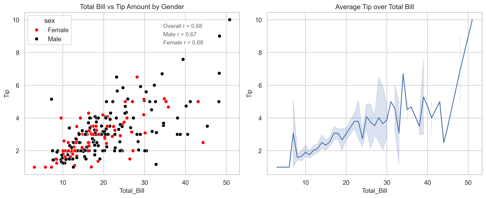
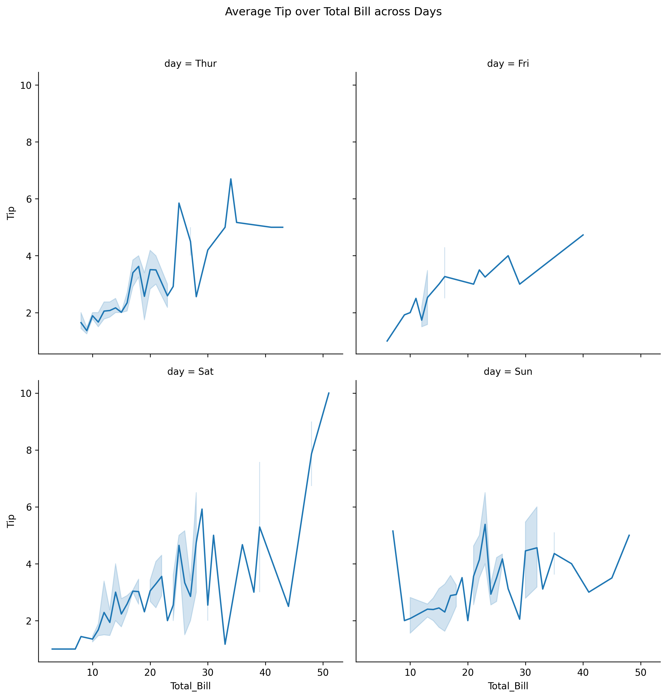
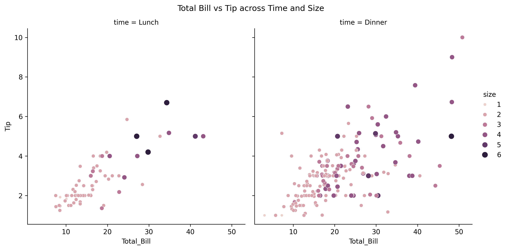
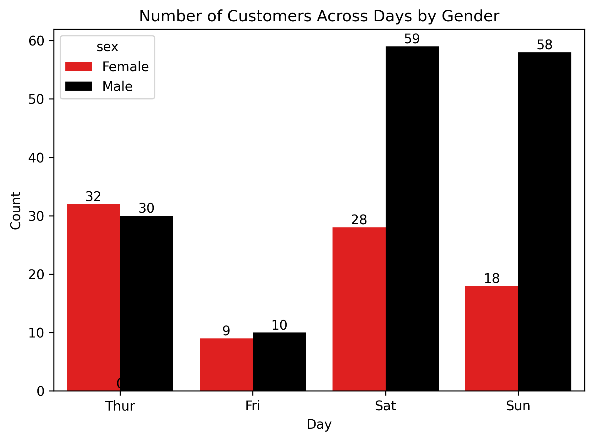
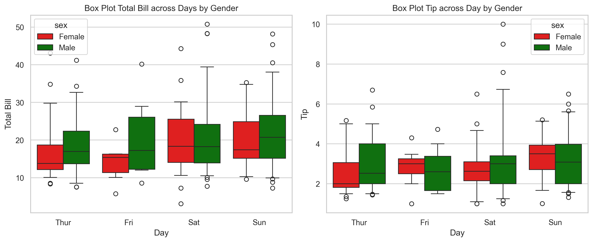
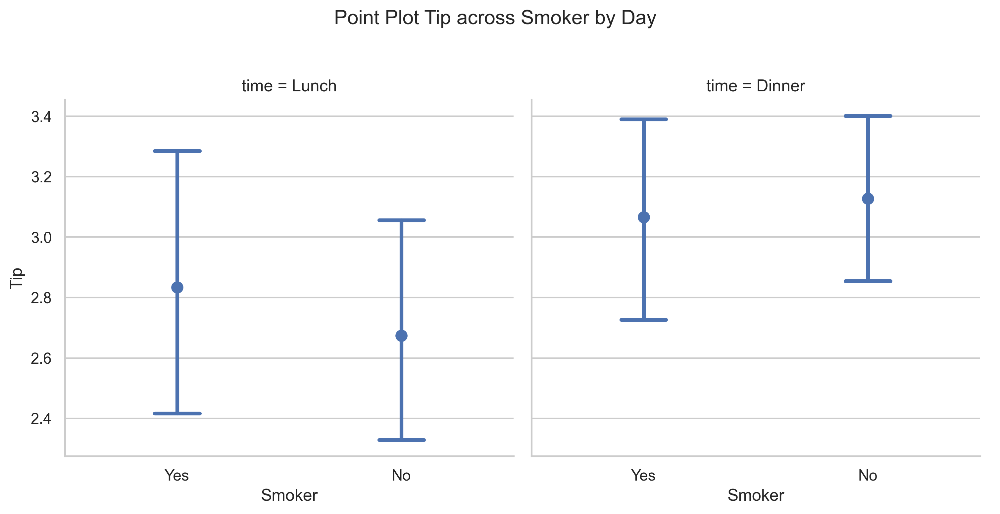

# 🧾 Tip Analysis Dashboard (Seaborn + Matplotlib)

This dashboard explores **tipping behavior** using Seaborn's `tips` dataset. It analyzes how tips vary by **total bill**, **day of the week**, **gender**, and **time of day** using clean and informative visualizations.

---

## 📊 Dataset

- **Source**: Seaborn built-in `tips` dataset
- **Key Columns**:
  - `total_bill`: Meal cost
  - `tip`: Tip amount
  - `sex`, `day`, `time`, `smoker` : Customer demographics and visit time
  - `size`: Party size

---

## 🔧 Requirements

Install the required packages:

```bash
pip install pandas seaborn matplotlib scipy

```
---
## 🧠 Questions & Visualizations

### 1. 💡 Q1: What's the relationship between Total Bill and Tip?
Chart: 
- Scatter Plot Based On Gender With Pearson Correlation
- Line Plot

Code:

``` python
#Data Preparation

sns.set_theme(style = 'whitegrid')
fig, ax = plt.subplots(1,2, figsize = (12,5))

hue_colors = {
    'Female':'Red',
    'Male':'Black'
}
total_bill = tips['total_bill']
tip = tips['tip']
male_total_bill = tips[tips['sex'] == 'Male']['total_bill']
male_tip = tips[tips['sex'] == 'Male']['tip']
female_total_bill = tips[tips['sex'] == 'Female']['total_bill']
female_tip = tips[tips['sex'] == 'Female']['tip']

#Person Correlation
overall_corr,_ = pearsonr(total_bill,tip)
male_corr,_ = pearsonr(male_total_bill,male_tip)
female_corr,_ = pearsonr(female_total_bill,female_tip)

#Scatter Plot
sns.scatterplot(
    data = tips, 
    x = 'total_bill',
    y = 'tip',
    hue = 'sex',
    hue_order=['Female','Male'],
    palette= hue_colors, 
    ax = ax[0]
)
ax[0].set_title('Total Bill vs Tip Amount by Gender', fontsize = 12)
ax[0].set_xlabel('Total_Bill', fontsize = 11)
ax[0].set_ylabel('Tip', fontsize = 11)
ax[0].tick_params(axis='x',labelsize = 11)
ax[0].tick_params(axis ='y', labelsize = 11)

correlations = [
    ('Overall',overall_corr),
    ('Male',male_corr),
    ('Female',female_corr)
]

start_y = 9.5
for i,(x,y) in enumerate(correlations):
    next_y = start_y - i*0.5
    start_x = ax[0].get_xlim()[1]*0.65 
    ax[0].text(
        start_x,
        next_y,
        f"{x} r = {y:.2f}",
        fontsize = 10,
        color = 'black',
        alpha = 0.6,
        bbox = dict(facecolor = 'white', alpha = 0.9)
    )

#LinePlot

sns.lineplot(
    data = tips,
    x = tips['total_bill'].round(0),
    y = 'tip',
    estimator='mean',
    markers='o',
    ax= ax[1]
)
ax[1].set_title('Average Tip over Total Bill', fontsize = 12)
ax[1].set_xlabel('Total_Bill', fontsize = 11)
ax[1].set_ylabel('Tip', fontsize = 11)
ax[1].tick_params(axis = 'x', labelsize = 11)
ax[1].tick_params(axis = 'y', labelsize = 11)

plt.tight_layout()
plt.show()
```



Insights: 
- **Line Plot:** Tips generally increase with bill size.
- **Scatter Plot**: 
  - Based on overall score pearson correlation of **0.68**, there is **a moderate positive correlation** between **tips growth and total bill**. 
  - Breaking it down by **gender**, the results for both male and female show similarly **a moderate positive correlation.** 

### 2. 💡 How does tipping differ by day of the week?
Chart: Relplot (kind = Line)

Code: 

```python
a = sns.relplot(
    data = tips,
    kind = 'line',
    x = tips['total_bill'].round(0),
    y = 'tip',
    col = 'day',
    col_wrap= 2,
    col_order=['Thur','Fri','Sat','Sun'],
    markers = True
)

a.fig.suptitle('Average Tip over Total Bill across Days',
               y = 1.03)

a.set_axis_labels('Total_Bill','Tip')
plt.tight_layout()
plt.show()

```


Insights:
- Across days of the week, the overall trend of the increase of total bill followed by tips is still continuing except for **Sunday** that shows more **dynamic trend** between total bill and tips. 

### 3. 💡 Do customers tip differently at lunch vs dinner?
Chart: Relplot(kind = Scatter )

Code:
```python
a = sns.relplot(
    data = tips,
    kind = 'scatter',
    x = 'total_bill',
    y = 'tip',
    col = 'time',
    size= 'size',
    hue = 'size',
    markers = 'o'
)

a.fig.suptitle('Total Bill vs Tip across Time and Size',
               y = 1.03)

a.set_axis_labels('Total_Bill','Tip')
plt.tight_layout()
plt.show()
```



Insights:
- The overall trend of the increase of total bill followed by tips is still applicable in both lunch and dinner time.
- People not only tend to **tip more on dinner** but also **the size of more than 2 people in a table are higher** compared to lunch time.

### 4.💡How many customers came in on each day of the week? Does gender play a role?

Chart: Count Plot

Code:
```python
hue_colors = {
    'Male':'Black',
    'Female':'Red'
}
hue_orders = ['Female','Male']
a = sns.countplot(
    data = tips,
    x = 'day',
    hue = 'sex',
    palette=hue_colors,
    hue_order=hue_orders
)
for i in a.patches:
    width = i.get_x() + i.get_width()/2
    height = i.get_height()
    a.text(
     width,
     height,
     f"{height:.0f}",
     fontsize = 10,
     ha = 'center',
     va = 'bottom'   
    )
a.set_title('Number of Customers Across Days by Gender')
a.set(xlabel = 'Day', ylabel='Count')
plt.tight_layout()
plt.show()
```


Insights:
- The number of customers between Male and Female that come on **weekday(Thursday & Friday) is nearly even**. The huge difference comes on **weekend** where Male is **over two times higher** on Saturday and **over three times higher** on Sunday compared to Female.

### 5. 💡 What’s the distribution of total bills and tip per day across gender?

Chart: Boxplot

Code:
```python
sns.set_theme(style='whitegrid')
fig,ax = plt.subplots(1,2, figsize=(12,5))

##Box Plot Total Bills Each Day across Gender
hue_colors = {
    'Male':'Green',
    'Female':'Red'
}
sns.boxplot(
    data = tips,
    x = 'day',
    y = 'total_bill',
    hue = 'sex',
    whis = [5,95],
    order=['Thur','Fri','Sat','Sun'],
    hue_order=['Female','Male'],
    palette=hue_colors,
    ax = ax[0]
)
ax[0].set_title('Box Plot Total Bill across Days by Gender')
ax[0].set_xlabel('Day')
ax[0].set_ylabel('Total Bill')

#Box Plot Tip Each Day across Gender

sns.boxplot(
    data=tips,
    x = 'day',
    y = 'tip',
    hue ='sex',
    whis = [5,95],
    order=['Thur','Fri','Sat','Sun'],
    hue_order=['Female','Male'],
    palette=hue_colors,
    ax = ax[1]
)
ax[1].set_title('Box Plot Tip across Day by Gender')
ax[1].set_xlabel('Day')
ax[1].set_ylabel('Tip')
plt.tight_layout()
plt.show()
```



Insights:
- Female tend to spend lesser than Male whether on weekday and weekend shown by the median. But both of genders are likely to spend more on weekend shown by the median, 75 & 95th percentile and the spread of outliers.
- Although Female spends lesser across the week, but they give more tips than Male on Friday and Sunday. Noted on those two days, Male spends way higher than Female.

### 6. 💡 What is the average tip given by smokers vs. non-smokers across different meal times?

Chart: Catplot(kind = Point)

Code:
```python
a = sns.catplot(
    data=tips,
    kind='point',
    x = 'smoker',
    y = 'tip',
    col = 'time',
    estimator='mean',
    linestyle = 'none',
    errorbar= ('ci',95),
    capsize = 0.2
)

a.fig.suptitle('Point Plot Tip across Smoker by Day', y = 1.03)
a.set_xlabels('Smoker')
a.set_ylabels('Tip')
plt.tight_layout()
plt.show()

```


Insights:
- Both smokers and non smokers show an increase in giving tips from lunch to dinner. But during lunch time, smokers tend to give more tips than non smokers as opposed to dinner time.